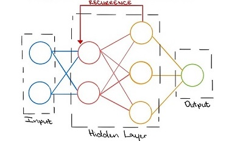

# Sentiment-Analysis

Duygu Analizi (aynı zamanda Fikir Madenciliği olarak da bilinen bir konudur) insanların sanal ortamlarda ürünler, hizmetler, olaylar, siyasi ve sosyal konular hakkında ifade ettikleri, yazılı metinler içerisinde saklı olan duygu ve düşüncelerini ortaya çıkarmayı amaçlamaktadır.

Duygu analizinde öznitelik seçimi, metin içerisinde sıklıkla tekrarlanan niteliklerin belirlenmesi, az rastlanan niteliklerin elenerek metnin ana karakterini belirleme çalışmasıdır. Üç temel amacı vardır. Bunlardan ilki, karmaşıklığı azaltması sebebiyle hesaplama zamanından fayda sağlamak, ikincisi veri ile fazlaca uyumlu analiz yapmayı önleme ve üçüncüsü sınıflandırma doğruluğunun geliştirilmesidir.

### Recurrent Neural Networks

.

Sıralı verileri modellemeye yönelik bir Derin Öğrenme yaklaşımı Tekrarlayan Sinir Ağlarıdır (RNN). Standart sinir ağlarındaki tüm girdi ve çıktılar birbirinden bağımsızdır, ancak bazı durumlarda, örneğin bir cümlenin sonraki kelimesini tahmin ederken, önceki kelimeler gereklidir ve bu nedenle önceki kelimelerin hatırlanması gerekir. RNN'nin en önemli bileşeni, bir dizi hakkındaki belirli bilgileri hatırlayan Gizli durumudur. RNN mimarisi çözmeye çalıştığımız soruna göre değişiklik gösterebilir. Tek bir girdi ve çıktıya ya da çok sayıda girdi/ çıktı içeren modeller vardır.

* One to one : Burada sadece bir girdi çıktı çifti vardır. Geleneksel sinir ağlarında birebir mimari kullanılmaktadır.
* One to many: Bire çok ağdaki tek bir giriş, çok sayıda çıktıyla sonuçlanabilir.
* Many to one: Farklı zaman adımlarından birçok girdi birleştirilerek tek bir çıktı üretilir. Duygu analizi ve duygu tanımlama, sınıf etiketinin bir dizi kelimeyle belirlendiği çalışmalarda bu tür ağlar kullanılır.
* Many to many: Çoktan çoğa, çok sayıda seçenek var. Örneğin iki girdi üç çıktı verir. Çeviri uygulamalarında kullanılabilir.
  
